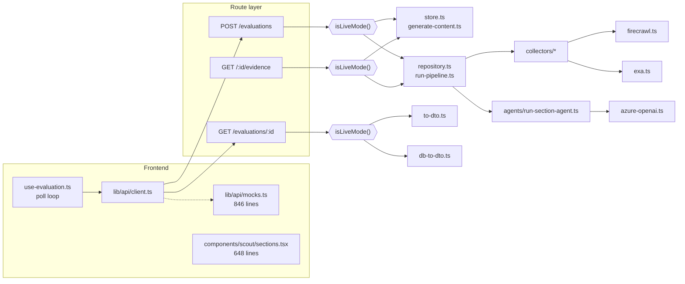
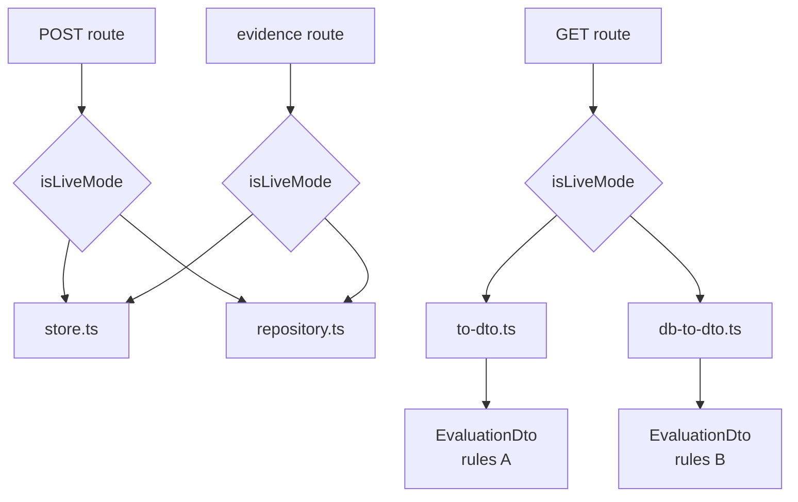
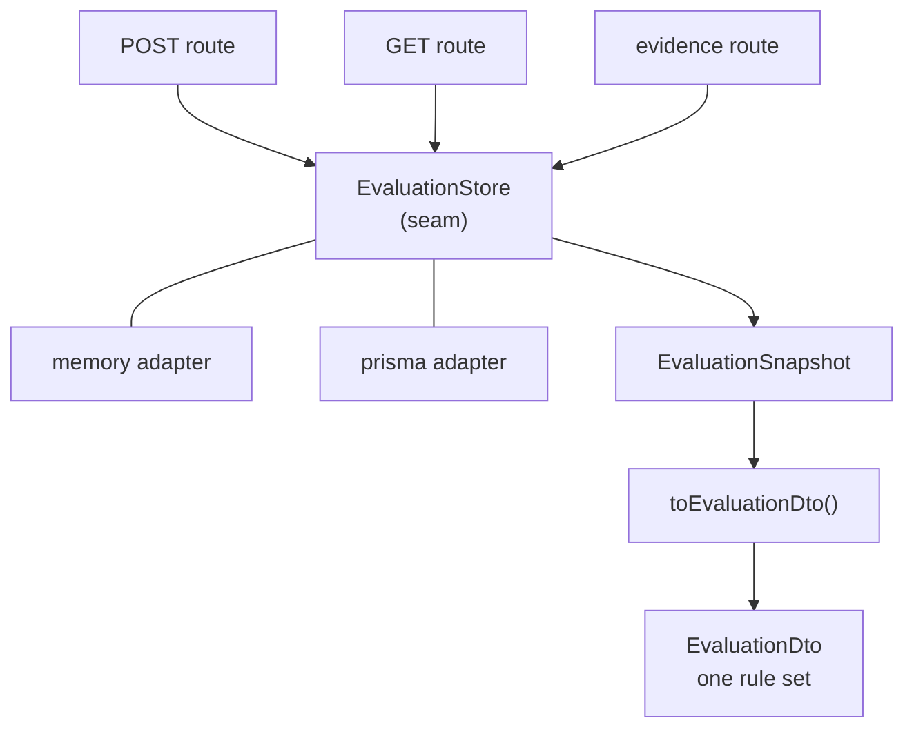
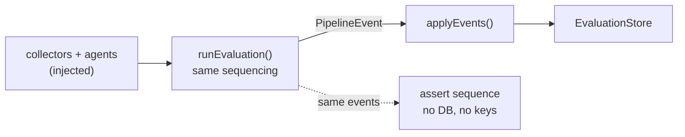
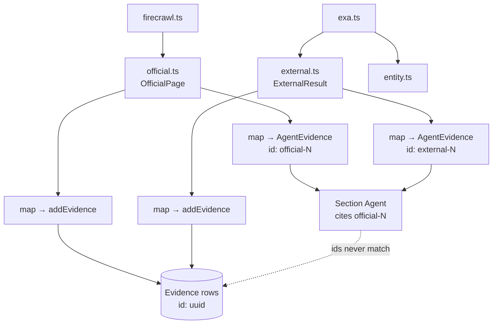
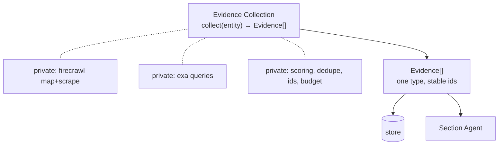
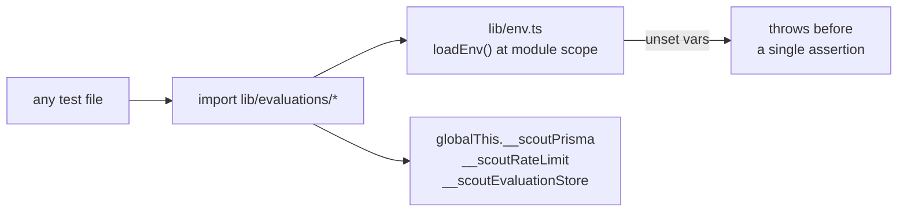
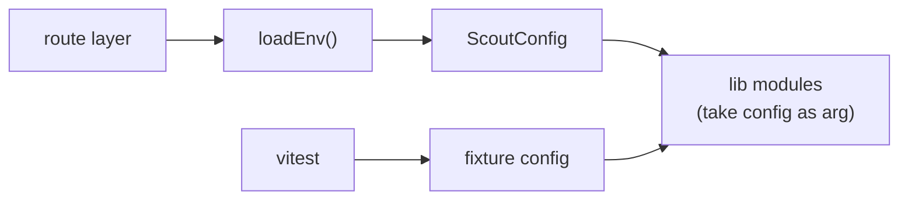
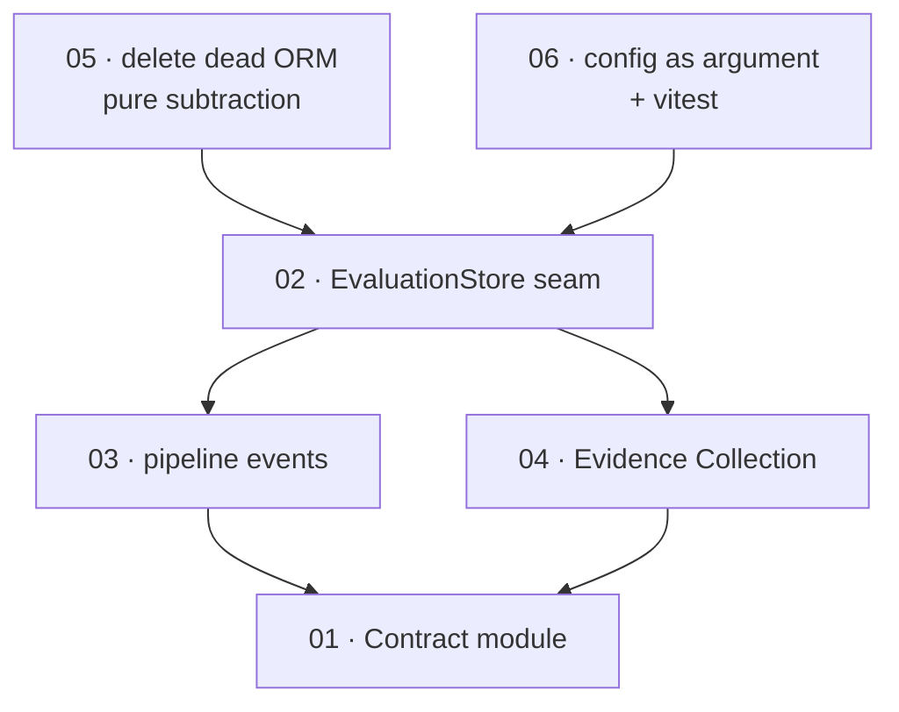

# scout-ai — Architecture Review

**Deepening opportunities.** Six candidates where a *shallow* module — interface nearly as complex as its
implementation — could be traded for a *deep* one. Each was checked against the deletion test: *would removing
this concentrate complexity, or just move it?*

Date: 2026-07-27 · Reviewed at commit `14bbb31` (branch `main`)

| | |
|---|---|
| Test files in repo | **0** |
| Hand-mirrored copies of the contract | **5** |
| Parallel pipelines / ORMs | **2** / **2** |
| Lines under `lib/` | **~2.9k** |

> **No `CONTEXT.md` and no `docs/adr/` in this repo.** Domain vocabulary below is lifted from the code and
> `docs/PRD.md` — *Evaluation*, *Report Section*, *Evidence*, *Finding*, *Claim*, *Entity Resolution*,
> *Collector*, *Section Agent*, *Phase*, *Verdict*. No ADR constrains any candidate here, so nothing below is
> re-litigating a recorded decision.

---

## Current shape



Three forks. Every route re-decides which universe it is in, and each branch reaches a *different* module that
produces the *same* DTO by a different route. That fork is the spine of candidates 1–3.

---

## Summary

| # | Candidate | Strength |
|---|---|---|
| 01 | [One Contract module, five hand-kept copies](#01--one-contract-module-five-hand-kept-copies) | **Strong** |
| 02 | [The `isLiveMode()` fork wants to be a seam](#02--the-islivemode-fork-wants-to-be-a-seam) | **Strong** |
| 03 | [The pipeline's decisions are welded to its writes](#03--the-pipelines-decisions-are-welded-to-its-writes) | **Strong** |
| 04 | [Evidence collection is three shallow layers deep](#04--evidence-collection-is-three-shallow-layers-deep) | Worth exploring |
| 05 | [Two ORMs, one of them dead](#05--two-orms-one-of-them-dead) | **Strong** |
| 06 | [Config is a module-load side effect](#06--config-is-a-module-load-side-effect) | Worth exploring |

---

## 01 · One Contract module, five hand-kept copies

**Strength: Strong**

### Files

| File | |
|---|---|
| `docs/API_CONTRACT.md` | 708 ln — prose |
| `lib/api-types.ts` | 375 ln — backend TS |
| `types/scout-api.ts` | 419 ln — frontend TS |
| `lib/agents/schemas.ts` | 234 ln — Zod |
| `prisma/schema.prisma` | Json columns |

### Problem

The *Evaluation* contract is written out five times, in four languages, and nothing checks that the copies
agree. `lib/api-types.ts` and `types/scout-api.ts` are near-identical files that never import each other; the
backend imports one, the frontend imports the other. The interface here is *bigger* than what it protects —
that is textbook shallowness.

The drift is already live. `ExecutiveSummaryData` carries its own `confidence` and `verdict`, while
`ReportSection.confidence` and `SummaryDto.verdict` carry them *again* as separate columns.
`run-pipeline.ts:255-262` picks the wrapper's confidence and the *recommendation* section's verdict — so a
report can serve two different confidence numbers for the same section, and no type error is possible.

### Solution

One **Contract module** under `lib/contract/`. Zod schemas are the single artefact; every TypeScript type is
`z.infer`'d from them. The Section Agents pass those exact schemas to `generateObject` — they already almost
do. The frontend imports the same inferred types. `types/scout-api.ts` is deleted; `API_CONTRACT.md` becomes
generated or narrative-only, not normative.

### Benefits

- **Leverage:** adding a field to a Report Section is one edit that simultaneously changes the LLM's output
  schema, the API response type, and the frontend renderer's prop type. Today it is four edits and a doc.
- **Locality:** the answer to "what shape is `pricing_intelligence`?" lives in exactly one file — for humans
  and for any agent navigating the repo.
- **Test surface:** contract conformance becomes a *runtime* check, not a hope. `Schema.parse(dto)` in one
  test covers every route response, and the redundant `confidence`/`verdict` fields get resolved rather than
  papered over.

### Before / After

**Before — 5 sources of truth**

```
              docs/API_CONTRACT.md
                       │
             ┌─── copy by hand ───┐
             ▼         ▼          ▼         ▼
      api-types.ts  scout-api.ts  schemas.ts  schema.prisma
      ──────────────────────────────────────────────────────
      no arrow between them is checked by anything
```

**After — 1 deep module**

```
                  lib/contract/  ← Zod schemas
                       │
              ┌── z.infer · derived ──┐
              ▼        ▼         ▼         ▼
         API types  FE types  agent schema  runtime parse
      ──────────────────────────────────────────────────────
      every arrow is the compiler's job
```

### Deletion test

Delete `types/scout-api.ts` → every frontend consumer must reach for the backend contract. Complexity
**concentrates**. That is the signal.

---

## 02 · The `isLiveMode()` fork wants to be a seam

**Strength: Strong**

### Files

- `app/api/v1/evaluations/route.ts` — `:40`, `:45-91`
- `app/api/v1/evaluations/[id]/route.ts` — `:22-34`
- `app/api/v1/evaluations/[id]/evidence/route.ts` — `:23-43`
- `lib/evaluations/store.ts` · `repository.ts`
- `lib/evaluations/to-dto.ts` · `db-to-dto.ts`

### Problem

Two complete *Evaluation* implementations run side by side, and the choice between them is re-made in every
route handler. The route is where request parsing, rate limiting, dedupe, persistence-mode selection, and DTO
shaping all collide — so the route is shallow-and-fat at once.

Worse, the two branches produce the same `EvaluationDto` by *different rules*:

| | `to-dto.ts` (stub) | `db-to-dto.ts` (live) |
|---|---|---|
| percent | lerped from elapsed time | phase → percent lookup table |
| etag | `W/"status-percent-n"` | `W/"timestamp-status-n"` |
| entity fields | hidden until a phase threshold | always visible |

The frontend polling loop in `use-evaluation.ts` is tuned against one of these and merely tolerated by the
other.

There are already **two adapters** here — so this is a *real* seam, not a hypothetical one. It just hasn't
been given an interface.

### Solution

Name the seam **EvaluationStore**: create, read one, find recent by domain, plus the pipeline's write
operations. Both existing modules become adapters behind it (in-memory, Prisma). Every store returns one
**EvaluationSnapshot** — the full *Evaluation* + Report Sections + Evidence + Findings — and there is exactly
*one* `toEvaluationDto(snapshot)`. Mode selection happens once, at module init, not three times in three
handlers.

### Benefits

- **Locality:** "how is `progress.percent` computed?" has one answer instead of two that disagree.
- **Leverage:** handlers shrink to parse → store → DTO. Adding a third backend (Redis, Inngest-durable) costs
  one adapter, zero route edits.
- **Test surface:** the in-memory adapter *becomes* the test double you'd otherwise have to write. Route
  tests, DTO tests, and polling-contract tests all run without Postgres — currently none of them can run at
  all.

### Before / After

**Before**



**After**



### Deletion test

Delete `db-to-dto.ts` → all DTO shaping must land in one module that both adapters feed. **Concentrates.**
Delete the `isLiveMode()` branches from routes → the decision has to move somewhere, and there is only one
sensible somewhere.

---

## 03 · The pipeline's decisions are welded to its writes

**Strength: Strong**

### Files

- `lib/evaluations/run-pipeline.ts` — 288 ln, 14 `repo.*` calls
- `lib/evaluations/repository.ts`
- `lib/agents/findings.ts`

### Problem

`runEvaluationPipeline` interleaves every domain decision with an `await repo.*`. The interesting logic is
precisely the interleaving: *which failures degrade a report to* `partial` *vs* `failed`; whether a missing
Executive Summary should still write a `summaryJson`; that a zero-Evidence run must terminate rather than
feed empty prompts to eleven Section Agents.

None of that is reachable without a live Postgres, a Firecrawl key, an Exa key and an Azure deployment. The
current shape is the failure mode the deep-module lens warns about in reverse: the pure helpers
(`buildFindingsFromRiskAssessment`, `selectTopPaths`) are trivially testable, and the real bugs live in the
orchestration that calls them — where there is no test surface at all.

### Solution

Keep the pipeline as one module — do *not* shred it into helpers. Change its interface to emit a stream of
**PipelineEvent**s (`PhaseEntered`, `EntityResolved`, `EvidenceCollected`, `SectionCompleted`,
`SectionFailed`, `RunSettled`) rather than calling the repository directly. A ~20-line applier folds events
into the EvaluationStore from candidate 02. Collectors and Section Agents arrive as constructor dependencies.

### Benefits

- **Locality preserved:** the sequencing stays in one readable function; only the *writes* move behind the
  seam. This is deepening, not extraction.
- **The interface is the test surface:** feed fake collectors and fake agents, collect the event list, assert
  the sequence. "Two sections fail → run settles `partial`" becomes a five-line test.
- **Leverage:** the same event stream is what a future SSE progress endpoint or an Inngest step-function
  would consume. Today those would each need a second copy of the orchestration.

### Before / After

**Before — logic and I/O interleaved** (`■` = I/O you can't fake · `◆` = the logic worth testing)

```
■ repo.setPhase
· resolveEntityLive
■ repo.setEntity
■ repo.setPhase
· collect × 2
■ repo.addEvidence × 2
◆ decide: no evidence → fail
■ repo.setSectionRunning × 9
· runSectionAgent × 9
■ repo.completeSection / failSection
◆ decide: partial vs completed
■ repo.markPartial / markCompleted
```

**After — one seam, events across it**



### Deletion test

Delete the 14 inline `repo.*` calls → the write policy must be stated once, in one place, instead of being
smeared across the run. **Concentrates.**

---

## 04 · Evidence collection is three shallow layers deep

**Strength: Worth exploring**

### Files

| File | |
|---|---|
| `lib/firecrawl.ts` | 19 ln |
| `lib/exa.ts` | 16 ln |
| `lib/collectors/official.ts` | `OfficialPage` |
| `lib/collectors/external.ts` | `ExternalResult` |
| `lib/collectors/entity.ts` | |
| `lib/evaluations/run-pipeline.ts` | `:69-125` |
| `lib/agents/run-section-agent.ts` | `AgentEvidence` |

### Problem

*Evidence* exists as four near-identical types — `OfficialPage`, `ExternalResult`, `AgentEvidence`,
`EvidenceItem` — and `run-pipeline.ts` maps between them **four times in 56 lines**: twice into
`repo.addEvidence`, twice into `evidenceForAgents`. The two mappings assign `id` differently, which is why
agent citations (`official-0`) can never resolve against stored Evidence rows (UUIDs) — a real correctness
gap hiding in the mapping noise.

Beneath that, `lib/exa.ts` and `lib/firecrawl.ts` are 19-line modules whose entire job is "construct a client,
throw if unconfigured" — and each collector then re-implements the same `try { getX() } catch { return [] }`
degradation dance. Interface complexity ≈ implementation complexity. Shallow.

### Solution

One **Evidence Collection** module with a single interface: `collect(entity) → Evidence[]`, where `Evidence`
is the contract type from candidate 01 (with a server-only `markdown` field). Firecrawl/Exa client
construction, the degrade-to-empty policy, dedupe, budget caps, and id assignment all move inside. Path
scoring and query building stay as private helpers — they are the depth.

### Benefits

- **Locality:** Evidence ids are minted once, so a Claim's `evidenceIds` means the same thing in the prompt,
  the DB and the UI. The citation bug stops being possible.
- **Leverage:** "add GitHub as a source" is one new private fetcher, not a new type + new mapping + new
  pipeline branch.
- **Test surface:** one fake `collect()` unblocks every pipeline test in candidate 03. Degradation ("no
  Firecrawl key → external-only") becomes assertable instead of a comment.

### Before / After

**Before — 4 types, 4 mappings**



**After — one deep module**



### Deletion test

Delete `lib/exa.ts` and `lib/firecrawl.ts` → client construction lands inside the one module that uses it.
**Concentrates.**

> Caveat: `exa.ts` has two consumers (external + entity), so verify entity resolution belongs inside this
> module before collapsing it — that is a question for a grilling session, not a foregone conclusion.

---

## 05 · Two ORMs, one of them dead

**Strength: Strong**

### Files

| File | |
|---|---|
| `lib/db.ts` | Prisma — used |
| `lib/db/index.ts` | Neon + Drizzle — unused |
| `lib/db/schema.ts` | `reports` table — no consumer |
| `drizzle.config.ts` | + 4 `db:drizzle:*` scripts |
| `lib/env.ts` | `:34-40` explains the overlap |

### Problem

`lib/db.ts` and `lib/db/index.ts` are two different databases, one import path apart. Drizzle defines a
`reports` table that no code reads or writes; Prisma defines
`Evaluation`/`ReportSection`/`Evidence`/`Finding`, which is the real model. `lib/env.ts` carries a comment
block explaining the coexistence of two Azure variable sets for the same reason.

Cost is navigational, and it falls hardest on agents: "where does an Evaluation persist?" has two plausible
answers, one of them wrong, and `@/lib/db` vs `@/lib/db/index` resolve to different modules. That is a trap,
not a seam.

### Solution

Pick one ORM and delete the other outright, along with its config, its npm scripts and its dependencies.
Collapse the duplicate `AZURE_*` variable pairs to one set. Behind candidate 02's seam, whichever survives is
the persistence adapter's private business anyway.

### Benefits

- **AI-navigability:** one answer to "where is persistence", with no near-miss import path.
- **Leverage:** smaller dependency surface, three fewer packages, one less migration toolchain to keep
  working.
- **Test surface:** unchanged — this is pure subtraction. Cheapest item on the list.

### Before / After

```
BEFORE                                AFTER
──────────────────────────            ──────────────────────
@/lib/db        Prisma · Evaluation…  @/lib/db   one ORM
      ≠                               ──────────────────────
@/lib/db/index  Drizzle · reports     — nothing else —
──────────────────────────
drizzle.config.ts
4 npm scripts
3 deps
2× AZURE_* var sets
```

### Deletion test

The purest case on the page: deleting the unused ORM moves complexity *nowhere*, because nothing depends on
it. **Strictly subtracts.**

---

## 06 · Config is a module-load side effect

**Strength: Worth exploring**

### Files

- `lib/env.ts` — `:76`, `export const env = loadEnv()`
- `lib/db.ts` · `rate-limit.ts` · `store.ts` — `globalThis` singletons
- `package.json` — no test runner

### Problem

`lib/env.ts` validates and throws at *import* time, and it is imported transitively by nearly every backend
module. Combined with four `globalThis.__scout*` singletons (Prisma client, rate-limit buckets, evaluation
store, env itself), importing almost anything in `lib/` commits you to a configured process.

This is why the repo has **zero tests and no test runner** — not discipline, but that the modules are
untestable by construction. Candidates 02–04 all end up blocked on this one. Separately, `checkRateLimit`
already takes `nowMs` as a parameter, showing the intent was there.

### Solution

Make `loadEnv()` the interface and the eager `env` const a route-layer convenience. Modules that need config
take it as an argument or a small `ScoutConfig` object. Add Vitest with a `node` environment. The rate limiter
and store keep their globals — those are legitimately process-scoped — but expose a constructor for tests.

### Benefits

- **The interface becomes the test surface** — currently there isn't one, at any level.
- **Leverage:** unblocks every other candidate's payoff. Without it, deepening the pipeline is a refactor you
  cannot verify.
- **Locality:** "what does this module need from the environment?" becomes visible in its signature instead
  of buried in a transitive import.

### Before / After

**Before — import = commitment**



**After — config crosses an interface**



### Deletion test

Weaker than the others. Deleting the eager `env` export mostly *moves* the call to route entry — the win is
testability and explicit dependencies, not concentration. Hence *Worth exploring*, and best done as the first
step of candidate 02 or 03 rather than on its own.

---

## Top recommendation

### Start with 02 — give the `isLiveMode()` fork a real seam

It is the only candidate where the seam is **already proven**. The rule is *one adapter = hypothetical seam,
two = real* — and there are literally two implementations of *Evaluation* persistence in the tree today, plus
two DTO builders that have already drifted apart on percent, etag format and entity visibility. The seam isn't
a bet about the future; it is a description of the present, missing only an interface.

It also pays for the rest. Candidate 03 needs somewhere for pipeline events to land — that is the store.
Candidate 04's stable Evidence ids need one owner of Evidence writes — that is the store. Candidate 06's
payoff is tests, and the in-memory adapter *is* the test double, already written. Doing 02 first turns 03, 04
and 06 from refactors-on-faith into verifiable ones.

Sequence: **05** first as a ten-minute clearing (delete the dead ORM so "where is persistence" has one answer
before you name the seam), then **02**, then **01** — the Contract module is highest-value overall but touches
every file, so it goes in after the structure has settled and tests exist to catch the drift it is meant to
prevent.



01 sits last not because it matters least — it is the highest-leverage change on the page — but because it is
a whole-tree edit that wants a test surface underneath it.

---

## Bugs surfaced along the way

Two of these are correctness issues, not just structure:

1. **Evidence ids never resolve** (candidate 04). Section Agents are handed evidence ids `official-N` /
   `external-N` and told to cite them in `claims[].evidenceIds`. The same evidence is stored with Prisma-minted
   UUIDs. Any UI that looks up a Claim's evidence by id finds nothing.
2. **Two confidence numbers for one section** (candidate 01). `ExecutiveSummaryData.confidence` and
   `ReportSection.confidence` are independent fields fed from different places; `run-pipeline.ts:255-262`
   reads the wrapper's, the section `data` carries the agent's.

---

*Vocabulary: module · interface · depth · seam · adapter · leverage · locality. No ADRs contradicted.*
