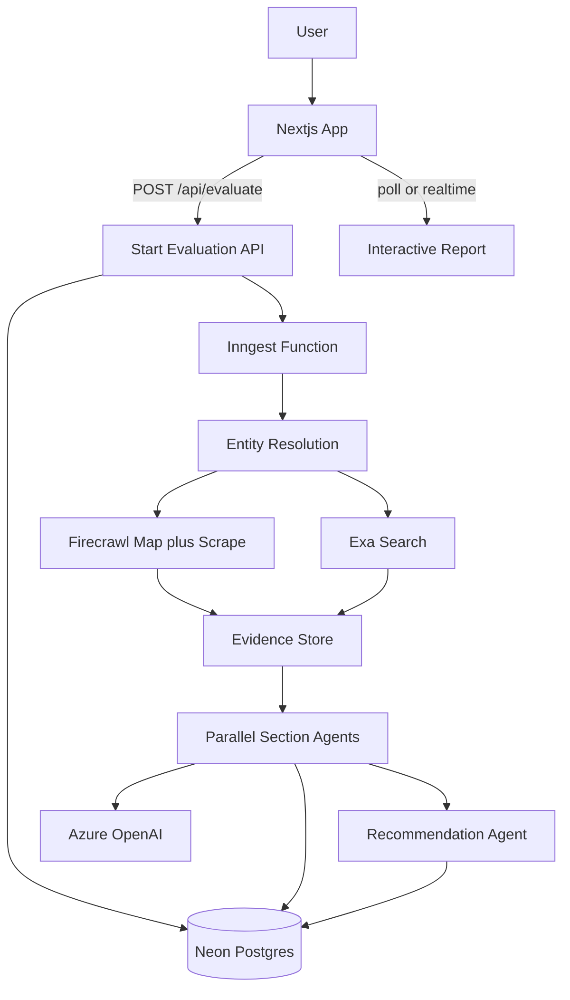

# Scout MVP — Firecrawl + Exa + Azure OpenAI on Vercel

**Repo:** `/Users/saurabhsingh/Documents/idea/scout-ai`  
**Codename:** Scout — AI Due Diligence Engine

## Locked decisions

- **Runtime:** Everything on Vercel (no Railway/Fly/Temporal)
- **LLM:** Azure OpenAI (chat completions for all agents)
- **Orchestration:** Inngest (durable functions that survive Vercel timeouts for 2–5 min jobs)
- **DB:** Neon Postgres via Prisma (Vercel-friendly)
- **Project path:** `/Users/saurabhsingh/Documents/idea/scout-ai`
- **Auth:** None for hackathon MVP (public evaluate form; rate-limit by IP later if needed)

## Architecture



### Why this shape

- Firecrawl + Exa do the web work; Azure OpenAI only reasons over collected evidence (keeps provenance honest).
- Inngest replaces Temporal for Vercel: each research step is a durable step with retries.
- Report is written section-by-section so the UI can stream progress instead of waiting for a single 5-minute response.

## Tech stack (MVP)

| Layer | Choice |
| --- | --- |
| App | Next.js 15 (App Router) + TypeScript + Tailwind + shadcn/ui |
| Jobs | Inngest on Vercel |
| DB | Neon Postgres + Prisma |
| Official sources | Firecrawl (`map` → selective `scrape` / small `crawl`) |
| External sources | Exa Search (`type: auto`, highlights/text, domain filters) |
| LLM | Azure OpenAI SDK (`@azure/openai` or OpenAI SDK with Azure endpoint) |
| Deploy | Vercel |

Skip for MVP: React Flow, Qdrant, Redis, auth, Crunchbase/LinkedIn/G2 APIs.

## Data model (Prisma)

Core tables:

- `Evaluation` — input URL/name, status (`queued|running|completed|failed`), overall score, recommendation, confidence, createdAt
- `Evidence` — source type (`official|external`), url, title, snippet/markdown, domain, fetchedAt, evaluationId
- `ReportSection` — section key, status, JSON payload, confidence, evaluationId
- `Finding` — claim, confidence, category, evidenceIds[], evaluationId (for provenance links)

Section keys (11 for MVP — covers success metric of 10+):

1. `executive_summary`
2. `company_overview`
3. `product_overview`
4. `feature_analysis`
5. `community_sentiment`
6. `security_compliance`
7. `pricing_intelligence`
8. `competitor_analysis`
9. `engineering_health`
10. `risk_assessment`
11. `recommendation`

Defer hiring intelligence + business signals to post-MVP (still collect Exa hits that feed risks/recommendation).

## Research pipeline (Inngest function)

Single function: `scout/evaluate.company`

1. **Entity resolution**
   - Normalize input (`linear.app` → `https://linear.app`)
   - Azure call: extract `{ companyName, domain, productHints }`
   - Persist evaluation row as `running`

2. **Official collection (Firecrawl)**
   - `map(domain)` → candidate URLs
   - Score/filter paths: `/pricing`, `/docs`, `/security`, `/privacy`, `/status`, `/changelog`, `/careers`, `/blog`, `/customers`, `/api`, homepage
   - Scrape top ~12–20 pages to markdown (cap for latency/credits)
   - Store as `Evidence` with `sourceType=official`

3. **External collection (Exa)** — parallel searches
   - Sentiment: site-restricted Reddit/HN/Product Hunt/blogs
   - Security: breaches, SOC2 mentions, incidents
   - Competitors: “alternatives to {company}”
   - Engineering: GitHub/docs/API quality signals
   - Pricing/reviews comparisons
   - Use `contents.highlights` / text; store URLs + excerpts as `Evidence`

4. **Parallel section agents** (Azure OpenAI, structured JSON outputs)
   - Each agent receives: entity + relevant evidence subset only
   - Must return: structured section JSON + claims with `confidence` + `evidenceIds`
   - Run sections in parallel after evidence is ready
   - Write each `ReportSection` as it completes (UI can poll)

5. **Recommendation agent**
   - Consumes all section JSON
   - Resolves contradictions
   - Emits final score, YES/NO/CONDITIONAL, best-suited / avoid-if, top 3+ non-obvious risks

6. **Mark evaluation `completed`**

Target latency: under 5 minutes via parallel Firecrawl scrapes + parallel Exa queries + parallel agents.

## API + UI

### Routes

- `POST /api/evaluate` — `{ input: string }` → `{ evaluationId }`
- `GET /api/evaluations/[id]` — status + completed sections + findings
- `POST /api/inngest` — Inngest serve handler
- Optional: `GET /api/evaluations/[id]/stream` SSE for live section updates

### Pages

- `/` — hero input: company name or URL + CTA “Evaluate”
- `/report/[id]` — progressive report
  - Sticky exec summary (score, recommendation, confidence)
  - Section nav
  - Each claim shows confidence + source links
  - Loading skeletons per unfinished section

Design constraint: one clear composition on the landing page (brand **Scout**, one headline, one short line, one CTA) — not a dashboard.

## Project structure

```
scout-ai/
  app/
    page.tsx
    report/[id]/page.tsx
    api/evaluate/route.ts
    api/evaluations/[id]/route.ts
    api/inngest/route.ts
  components/
    evaluate-form.tsx
    report/...
  lib/
    firecrawl.ts
    exa.ts
    azure-openai.ts
    db.ts
    prompts/...
    schemas/...          # zod schemas per section
  inngest/
    client.ts
    functions/evaluate-company.ts
  prisma/schema.prisma
  docs/
    PLAN.md              # this file
    PRD.md               # product requirements (optional)
```

## Env vars (Vercel)

- `DATABASE_URL`
- `FIRECRAWL_API_KEY`
- `EXA_API_KEY`
- `AZURE_OPENAI_API_KEY`
- `AZURE_OPENAI_ENDPOINT`
- `AZURE_OPENAI_DEPLOYMENT` (chat model deployment name)
- `AZURE_OPENAI_API_VERSION`
- `INNGEST_EVENT_KEY` / `INNGEST_SIGNING_KEY`

## Implementation phases

### Phase 0 — Bootstrap (day 0)
- Init Next.js + Tailwind + shadcn + Prisma + Inngest in this repo
- Wire Azure OpenAI client smoke test
- Deploy empty app to Vercel

### Phase 1 — Collect (day 1)
- Entity resolution + Firecrawl map/scrape pipeline
- Exa multi-query collector with domain filters
- Persist evidence; simple debug page listing sources

### Phase 2 — Reason (day 1–2)
- Zod schemas for all 11 sections
- Section agents with confidence + evidence IDs
- Recommendation agent
- Inngest orchestration end-to-end

### Phase 3 — Report UI (day 2)
- Progressive `/report/[id]` with polling
- Exec summary + risk table + source-linked findings
- Demo path: Linear, Notion, Vercel, Stripe, Supabase

### Phase 4 — Hackathon polish (day 2–3)
- Caching: reuse completed evaluation by domain for 24h
- Credit/latency caps (max pages, max Exa results)
- Error states + partial reports if one agent fails
- README with architecture + env setup

## Success criteria (hackathon)

- Full evaluation under ~5 minutes for a public SaaS site
- 11 structured sections with confidence scores
- ≥3 non-obvious risks with source links
- Works on 50+ popular SaaS domains without per-company config
- Every key finding links to underlying evidence URLs

## Explicit non-goals for MVP

- Temporal, Redis, Qdrant
- Auth / multi-tenant orgs
- Structured APIs (Crunchbase, G2, BuiltWith)
- React Flow knowledge graph UI
- Perfect ARR/funding numbers (mark low confidence when inferred)

## Implementation todos

- [ ] Bootstrap Next.js, Tailwind, shadcn, Prisma/Neon, Inngest; wire Azure OpenAI + Vercel env
- [ ] Implement entity resolution, Firecrawl map/scrape, Exa multi-query collectors, Evidence persistence
- [ ] Add Zod schemas + Azure section agents + recommendation agent with confidence and evidenceIds
- [ ] Orchestrate evaluate-company Inngest function with durable steps and partial section writes
- [ ] Build landing evaluate form and progressive `/report/[id]` with provenance links
- [ ] Add domain cache, credit caps, partial-failure handling, demo companies, README
