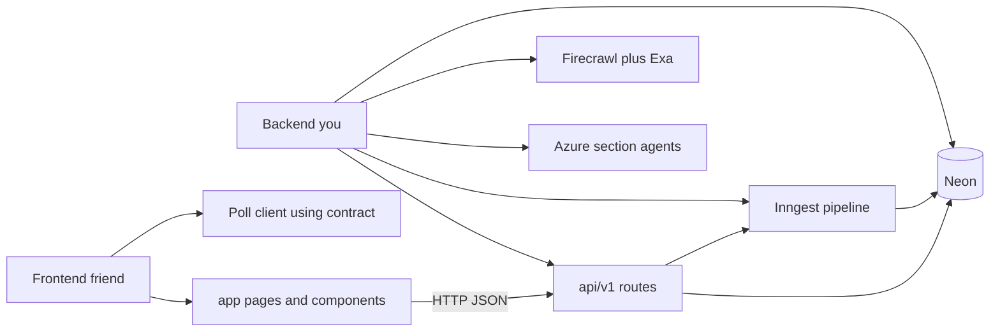
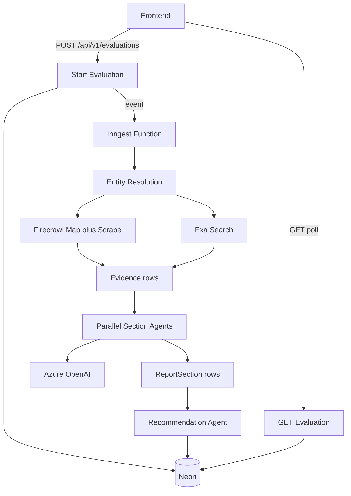

# Scout MVP — Backend Plan (Staff Engineer)

**Repo:** `/Users/saurabhsingh/Documents/idea/scout-ai`  
**Codename:** Scout — AI Due Diligence Engine  
**Your ownership:** Backend end-to-end (API, jobs, collectors, agents, DB, deploy)  
**Friend ownership:** Frontend (landing + progressive report UI against frozen contract)

> **Frontend handoff (start now):** [`FE_HANDOFF.md`](./FE_HANDOFF.md) → [`API_CONTRACT.md`](./API_CONTRACT.md) + [`fixtures/README.md`](./fixtures/README.md)

---

## Locked decisions

- **Runtime:** Everything on Vercel (no Railway/Fly/Temporal)
- **LLM:** Azure OpenAI (all agents)
- **Orchestration:** Inngest durable functions (2–5 min jobs)
- **DB:** Neon Postgres + Prisma
- **API surface:** Versioned `/api/v1/*` — contract frozen for MVP
- **Auth:** None for hackathon MVP
- **Monorepo shape:** Single Next.js app; shared types in `lib/api-types.ts` (imported by routes + eventually FE)

---

## Ownership boundary



| You own | Friend owns |
| --- | --- |
| Prisma schema, migrations | `/`, `/report/[id]` UI |
| `POST/GET /api/v1/evaluations*` | Form UX, progress, section renderers |
| Inngest `scout/evaluate.company` | Polling / ETag client |
| Firecrawl + Exa clients | Design system / Tailwind polish |
| Azure agents + Zod schemas | Mapping contract → components |
| Fixtures + stub API for FE | Using mocks until stubs are live |
| Vercel env + deploy of API | Consuming deployed preview URL |

**Contract rule:** Any breaking JSON change requires bump to `/api/v2` or a same-day FE sync. Additive fields are OK.

---

## Architecture (backend)



### Why this shape

- Firecrawl/Exa gather evidence; Azure only reasons (provenance stays honest).
- Inngest survives Vercel timeouts; each step is durable + retryable.
- Sections write incrementally so FE polls a growing report.

---

## API contract (summary)

Full spec: [`docs/API_CONTRACT.md`](./API_CONTRACT.md)

| Method | Path | Behavior |
| --- | --- | --- |
| `POST` | `/api/v1/evaluations` | Validate input → create row `queued` → enqueue Inngest → `201` with `{ id, pollAfterMs, reportUrl }` |
| `GET` | `/api/v1/evaluations/:id` | Full report DTO + progress + sections + findings + evidence summary; supports `If-None-Match` → `304` |
| `GET` | `/api/v1/evaluations/:id/evidence` | Paginated evidence |
| `GET` | `/api/v1/health` | Liveness |
| `POST` | `/api/inngest` | **Internal only** — FE never calls |

### FE integration rules you must honor in handlers

1. Always wrap success payloads in `{ data: ... }` and errors in `{ error: { code, message, details? } }`.
2. Always return all 11 section keys (even `pending`) so FE can render skeletons in fixed order.
3. Drive polling via `poll.shouldPoll` + `poll.pollAfterMs` + `poll.etag`.
4. Fill top-level `summary` when exec summary / recommendation completes (sticky header).
5. Every important claim carries `confidence` + `evidenceIds`.

### Stub-first delivery (unblock friend tomorrow)

1. Ship contract + fixtures (done).
2. Implement routes that return fixtures when `SCOUT_API_MODE=stub`.
3. Flip to `live` when Inngest pipeline works — same response shape.

---

## Data model (Prisma)

```prisma
// Conceptual — exact schema in prisma/schema.prisma during bootstrap

model Evaluation {
  id             String   @id @default(uuid())
  input          String
  normalizedUrl  String?
  companyName    String?
  domain         String?
  status         String   // queued|running|completed|failed|partial
  phase          String
  contextJson    Json?
  summaryJson    Json?
  errorJson      Json?
  progressJson   Json?
  overallScore   Float?
  verdict        String?
  confidence     Int?
  createdAt      DateTime @default(now())
  updatedAt      DateTime @updatedAt
  completedAt    DateTime?
  evidence       Evidence[]
  sections       ReportSection[]
  findings       Finding[]
}

model Evidence {
  id           String   @id @default(uuid())
  evaluationId String
  sourceType   String   // official|external
  url          String
  title        String?
  domain       String?
  snippet      String?
  markdown     String?  // server-only; not returned on poll by default
  fetchedAt    DateTime
}

model ReportSection {
  id           String   @id @default(uuid())
  evaluationId String
  key          String   // SectionKey
  title        String
  status       String   // pending|running|completed|failed
  confidence   Int?
  dataJson     Json?
  errorJson    Json?
  updatedAt    DateTime @updatedAt
  @@unique([evaluationId, key])
}

model Finding {
  id           String   @id @default(uuid())
  evaluationId String
  category     String
  severity     String
  title        String
  summary      String
  confidence   Int
  evidenceIds  String[]
  sectionKey   String
}
```

---

## Research pipeline (Inngest)

Function id: `scout/evaluate.company`  
Event: `scout/evaluation.requested` `{ evaluationId }`

| Step | Responsibility | Failure policy |
| --- | --- | --- |
| `resolve-entity` | Normalize URL; Azure extract name/domain | Fail evaluation |
| `collect-official` | Firecrawl map → scrape ≤20 pages | Fail if zero pages |
| `collect-external` | Parallel Exa queries (sentiment, security, competitors, eng, pricing) | Continue with partial external |
| `seed-sections` | Ensure 11 section rows `pending` | — |
| `analyze-sections` | Fan-out Azure agents (parallel) | Mark section `failed`; continue |
| `recommend` | Recommendation + summary + top findings | If fail → `partial` if any sections ok |
| `finalize` | `completed` / `partial` / `failed` + etag material | — |

Target: **under 5 minutes** via parallel scrape/search/agents.

---

## Backend module layout

```
scout-ai/
  app/api/v1/evaluations/route.ts          # POST
  app/api/v1/evaluations/[id]/route.ts     # GET
  app/api/v1/evaluations/[id]/evidence/route.ts
  app/api/v1/health/route.ts
  app/api/inngest/route.ts
  lib/
    api-types.ts                           # shared contract types (FE copies or imports)
    api-errors.ts                          # error envelope helpers
    db.ts
    firecrawl.ts
    exa.ts
    azure-openai.ts
    evaluations/
      create-evaluation.ts
      get-evaluation-dto.ts                 # maps DB → contract DTO
      etag.ts
    collectors/
      official.ts
      external.ts
      entity.ts
    agents/
      run-section-agent.ts
      prompts/
      schemas/                             # zod per SectionKey
  inngest/
    client.ts
    functions/evaluate-company.ts
  docs/
    API_CONTRACT.md
    PLAN.md
    PRD.md
    fixtures/
```

---

## Env vars (Vercel)

- `DATABASE_URL`
- `FIRECRAWL_API_KEY`
- `EXA_API_KEY`
- `AZURE_OPENAI_API_KEY`
- `AZURE_OPENAI_ENDPOINT`
- `AZURE_OPENAI_DEPLOYMENT`
- `AZURE_OPENAI_API_VERSION`
- `INNGEST_EVENT_KEY` / `INNGEST_SIGNING_KEY`
- `SCOUT_API_MODE` = `stub` \| `live`

---

## Implementation phases (backend-led)

### Phase 0 — Contract + stub API (FE unblocking) — done

- [`API_CONTRACT.md`](./API_CONTRACT.md) is the source of truth
- Implemented `/api/v1/health`, `/api/v1/evaluations` (POST), `/api/v1/evaluations/[id]` (GET, ETag/304), `/api/v1/evaluations/[id]/evidence` (GET)
- Backing logic lives in `lib/evaluations/`:
  - `domain.ts` — entity resolution from raw input (URL / bare domain / company name); inputs containing `"fail"` simulate a pipeline failure for FE testing
  - `generate-content.ts` — deterministic, contract-shaped section/finding/evidence content per company
  - `progress.ts` — pure function mapping elapsed time → phase/percent/section statuses (no timers, so it's safe to recompute on any request)
  - `store.ts` — in-memory record store (dev-safe global singleton; **not** durable across serverless cold starts — Phase 1 replaces this with Prisma)
  - `to-dto.ts` — maps a record → the exact `EvaluationDto` contract shape, including ETag + `poll`
- `lib/api-types.ts` mirrors the contract 1:1; `lib/api-errors.ts` provides the `{ data }` / `{ error }` envelope helpers
- Inngest client + `/api/inngest` route + `evaluate-company` function skeleton added (`inngest/`) — documents the Phase 1-3 steps but is **not yet wired** to the API
- Prisma schema added (`prisma/schema.prisma`, Prisma ORM 7 style: `prisma-client` generator + `@prisma/adapter-pg`, config in `prisma.config.ts`) — schema is ready but not yet used by any route
- Verified via `bun run typecheck`, `bun run lint`, and live curl testing of the full create → poll → complete flow, the 404 case, ETag/304, evidence filtering, and the simulated failure path

**Known limitation (by design):** the in-memory store means evaluations don't persist across server restarts or multiple serverless instances. This is acceptable for local FE development and demo now; Phase 1 below removes this limitation without changing the API contract.

### Phase 1 — Persistence + job skeleton

- Set a real `DATABASE_URL` (Neon) and run `bun run db:generate` + `bun run db:push`
- Swap `lib/evaluations/store.ts` for Prisma-backed reads/writes (same `EvaluationRecord`-shaped interface so `to-dto.ts` barely changes)
- Real `POST` creates DB rows + sends the `scout/evaluation.requested` event to Inngest instead of running the local simulation
- Real `GET` assembles the DTO from DB rows (sections start `pending`)
- Progress/phase updates come from the Inngest function's steps instead of the time-based simulator

### Phase 2 — Collectors

- Entity resolution
- Firecrawl map/scrape with path scoring + credit caps
- Exa multi-query collector
- Evidence persistence (markdown server-side; snippets in API)

### Phase 3 — Agents

- Zod schemas matching contract §8
- Parallel section agents via Azure OpenAI (structured JSON)
- Recommendation agent + findings (≥3 non-obvious risks)
- Partial failure handling → `partial` status

### Phase 4 — Production hardening

- 24h domain cache / dedupe
- Rate limit on `POST`
- ETag / 304
- Latency + credit caps
- Observability logs per step
- README + demo companies

Frontend phases run in parallel from Phase 0 using mocks/stubs.

---

## Success criteria

- Full evaluation under ~5 minutes for public SaaS
- 11 sections with confidence scores
- ≥3 source-linked risks not obvious from homepage
- Works on 50+ SaaS domains without per-company config
- Contract-compatible responses so FE needs zero guesswork

## Non-goals (MVP)

- Temporal, Redis, Qdrant, auth, G2/Crunchbase APIs, React Flow UI

---

## Todos

- [x] Freeze API contract + fixtures + FE handoff doc
- [x] Bootstrap Next.js deps (Prisma/Neon + Inngest); add `lib/api-types.ts` from contract
- [x] Ship working `/api/v1/evaluations` (POST + GET) + `/evidence` + `/health` backed by a deterministic in-memory simulation
- [x] ETag/304 support on `GET /api/v1/evaluations/[id]`
- [x] Prisma schema + Inngest client/function skeleton (not wired yet)
- [ ] Wire real Prisma persistence + Inngest event dispatch (replace `lib/evaluations/store.ts`)
- [ ] Firecrawl official + Exa external collectors
- [ ] Azure section agents + recommendation + findings
- [ ] Cache, rate limit, polish, README
