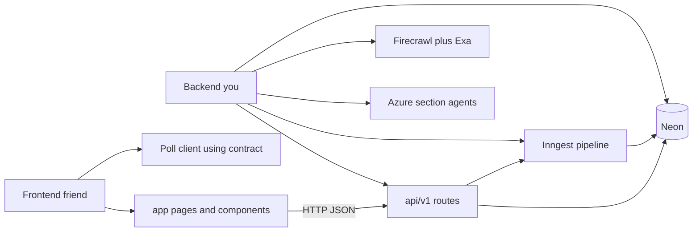
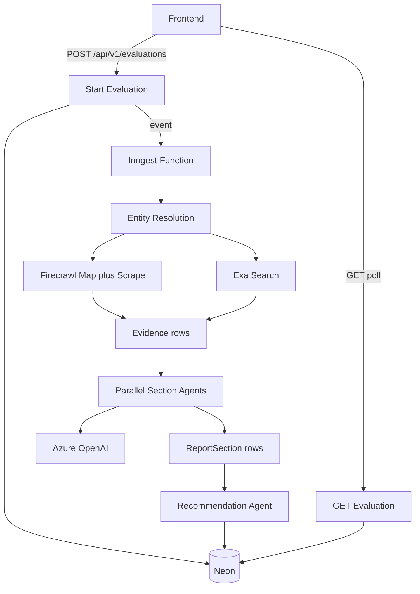

# Scout MVP — Backend Plan (Staff Engineer)

**Repo:** `/Users/saurabhsingh/Documents/idea/scout-ai`  
**Codename:** Scout — AI Due Diligence Engine  
**Your ownership:** Backend end-to-end (API, jobs, collectors, agents, DB, deploy)  
**Friend ownership:** Frontend (landing + progressive report UI against frozen contract)

> **Frontend handoff (start now):** [`FE_HANDOFF.md`](./FE_HANDOFF.md) → [`API_CONTRACT.md`](./API_CONTRACT.md) + [`fixtures/README.md`](./fixtures/README.md)

---

## Locked decisions

- **Runtime:** Everything on Vercel (no Railway/Fly/Temporal)
- **LLM:** Azure OpenAI (all agents)
- **Orchestration:** Inngest durable functions (2–5 min jobs)
- **DB:** Neon Postgres + Prisma
- **API surface:** Versioned `/api/v1/*` — contract frozen for MVP
- **Auth:** None for hackathon MVP
- **Monorepo shape:** Single Next.js app; shared types in `lib/api-types.ts` (imported by routes + eventually FE)

---

## Ownership boundary



| You own | Friend owns |
| --- | --- |
| Prisma schema, migrations | `/`, `/report/[id]` UI |
| `POST/GET /api/v1/evaluations*` | Form UX, progress, section renderers |
| Inngest `scout/evaluate.company` | Polling / ETag client |
| Firecrawl + Exa clients | Design system / Tailwind polish |
| Azure agents + Zod schemas | Mapping contract → components |
| Fixtures + stub API for FE | Using mocks until stubs are live |
| Vercel env + deploy of API | Consuming deployed preview URL |

**Contract rule:** Any breaking JSON change requires bump to `/api/v2` or a same-day FE sync. Additive fields are OK.

---

## Architecture (backend)



### Why this shape

- Firecrawl/Exa gather evidence; Azure only reasons (provenance stays honest).
- Inngest survives Vercel timeouts; each step is durable + retryable.
- Sections write incrementally so FE polls a growing report.

---

## API contract (summary)

Full spec: [`docs/API_CONTRACT.md`](./API_CONTRACT.md)

| Method | Path | Behavior |
| --- | --- | --- |
| `POST` | `/api/v1/evaluations` | Validate input → create row `queued` → enqueue Inngest → `201` with `{ id, pollAfterMs, reportUrl }` |
| `GET` | `/api/v1/evaluations/:id` | Full report DTO + progress + sections + findings + evidence summary; supports `If-None-Match` → `304` |
| `GET` | `/api/v1/evaluations/:id/evidence` | Paginated evidence |
| `GET` | `/api/v1/health` | Liveness |
| `POST` | `/api/inngest` | **Internal only** — FE never calls |

### FE integration rules you must honor in handlers

1. Always wrap success payloads in `{ data: ... }` and errors in `{ error: { code, message, details? } }`.
2. Always return all 11 section keys (even `pending`) so FE can render skeletons in fixed order.
3. Drive polling via `poll.shouldPoll` + `poll.pollAfterMs` + `poll.etag`.
4. Fill top-level `summary` when exec summary / recommendation completes (sticky header).
5. Every important claim carries `confidence` + `evidenceIds`.

### Stub-first delivery (unblock friend tomorrow)

1. Ship contract + fixtures (done).
2. Implement routes that return fixtures when `SCOUT_API_MODE=stub`.
3. Flip to `live` when Inngest pipeline works — same response shape.

---

## Data model (Prisma)

```prisma
// Conceptual — exact schema in prisma/schema.prisma during bootstrap

model Evaluation {
  id             String   @id @default(uuid())
  input          String
  normalizedUrl  String?
  companyName    String?
  domain         String?
  status         String   // queued|running|completed|failed|partial
  phase          String
  contextJson    Json?
  summaryJson    Json?
  errorJson      Json?
  progressJson   Json?
  overallScore   Float?
  verdict        String?
  confidence     Int?
  createdAt      DateTime @default(now())
  updatedAt      DateTime @updatedAt
  completedAt    DateTime?
  evidence       Evidence[]
  sections       ReportSection[]
  findings       Finding[]
}

model Evidence {
  id           String   @id @default(uuid())
  evaluationId String
  sourceType   String   // official|external
  url          String
  title        String?
  domain       String?
  snippet      String?
  markdown     String?  // server-only; not returned on poll by default
  fetchedAt    DateTime
}

model ReportSection {
  id           String   @id @default(uuid())
  evaluationId String
  key          String   // SectionKey
  title        String
  status       String   // pending|running|completed|failed
  confidence   Int?
  dataJson     Json?
  errorJson    Json?
  updatedAt    DateTime @updatedAt
  @@unique([evaluationId, key])
}

model Finding {
  id           String   @id @default(uuid())
  evaluationId String
  category     String
  severity     String
  title        String
  summary      String
  confidence   Int
  evidenceIds  String[]
  sectionKey   String
}
```

---

## Research pipeline (Inngest)

Function id: `scout/evaluate.company`  
Event: `scout/evaluation.requested` `{ evaluationId }`

| Step | Responsibility | Failure policy |
| --- | --- | --- |
| `resolve-entity` | Normalize URL; Azure extract name/domain | Fail evaluation |
| `collect-official` | Firecrawl map → scrape ≤20 pages | Fail if zero pages |
| `collect-external` | Parallel Exa queries (sentiment, security, competitors, eng, pricing) | Continue with partial external |
| `seed-sections` | Ensure 11 section rows `pending` | — |
| `analyze-sections` | Fan-out Azure agents (parallel) | Mark section `failed`; continue |
| `recommend` | Recommendation + summary + top findings | If fail → `partial` if any sections ok |
| `finalize` | `completed` / `partial` / `failed` + etag material | — |

Target: **under 5 minutes** via parallel scrape/search/agents.

---

## Backend module layout

```
scout-ai/
  app/api/v1/evaluations/route.ts          # POST (branches stub/live via lib/env.ts)
  app/api/v1/evaluations/[id]/route.ts     # GET (ETag/304, stub or live DTO mapper)
  app/api/v1/evaluations/[id]/evidence/route.ts
  app/api/v1/health/route.ts
  app/api/inngest/route.ts
  lib/
    api-types.ts                           # shared contract types (FE copies or imports)
    api-errors.ts                          # error envelope helpers
    env.ts                                 # centralized zod-validated env config
    db.ts                                  # Prisma client (adapter-pg)
    firecrawl.ts / exa.ts / azure-openai.ts # lazy SDK client singletons
    evaluations/
      store.ts / progress.ts / generate-content.ts / to-dto.ts   # stub pipeline (Phase 0)
      domain.ts                            # pure entity resolution (used by both stub + live)
      repository.ts                        # Prisma CRUD (live pipeline)
      db-to-dto.ts                         # maps Prisma row -> contract DTO (live pipeline)
      rate-limit.ts                        # in-memory per-IP limiter
      validation.ts                        # zod request schemas
    collectors/
      entity.ts (Exa fallback for name-only input)
      official.ts (Firecrawl map + scored scrape)
      external.ts (Exa multi-query)
    agents/
      schemas.ts                           # zod per SectionKey, matches api-types exactly
      prompts.ts
      run-section-agent.ts                 # generic generateObject runner
      findings.ts                          # risk_assessment -> top-level findings[]
  inngest/
    client.ts
    functions/evaluate-company.ts          # full durable pipeline
  prisma/schema.prisma
  docs/
    API_CONTRACT.md
    PLAN.md
    PRD.md
    fixtures/
```

---

## Env vars (Vercel)

All read through `lib/env.ts` (zod-validated; see `.env.example` for the authoritative list):

- `DATABASE_URL`
- `FIRECRAWL_API_KEY` (+ optional `FIRECRAWL_API_URL` for self-hosted)
- `EXA_API_KEY`
- `AZURE_OPENAI_API_KEY`
- `AZURE_OPENAI_ENDPOINT`
- `AZURE_OPENAI_DEPLOYMENT`
- `AZURE_OPENAI_API_VERSION`
- `INNGEST_EVENT_KEY` / `INNGEST_SIGNING_KEY` (auto-detected as dev mode locally when unset)
- `SCOUT_API_MODE` = `stub` \| `live`
- `SCOUT_RATE_LIMIT_PER_MINUTE` (default `5`), `SCOUT_DEDUPE_WINDOW_HOURS` (default `24`)
- `AZURE_RESOURCE_NAME` / `AZURE_API_KEY` / `AZURE_DEPLOYMENT_NAME` — separate from the `AZURE_OPENAI_*` vars above; used by the frontend's own AI chat feature (`lib/ai.ts`), not the evaluation pipeline

---

## Implementation phases (backend-led)

### Phase 0 — Contract + stub API (FE unblocking) — done

- [`API_CONTRACT.md`](./API_CONTRACT.md) is the source of truth
- Implemented `/api/v1/health`, `/api/v1/evaluations` (POST), `/api/v1/evaluations/[id]` (GET, ETag/304), `/api/v1/evaluations/[id]/evidence` (GET)
- Backing logic lives in `lib/evaluations/`:
  - `domain.ts` — entity resolution from raw input (URL / bare domain / company name); inputs containing `"fail"` simulate a pipeline failure for FE testing
  - `generate-content.ts` — deterministic, contract-shaped section/finding/evidence content per company
  - `progress.ts` — pure function mapping elapsed time → phase/percent/section statuses (no timers, so it's safe to recompute on any request)
  - `store.ts` — in-memory record store (dev-safe global singleton; **not** durable across serverless cold starts — Phase 1 replaces this with Prisma)
  - `to-dto.ts` — maps a record → the exact `EvaluationDto` contract shape, including ETag + `poll`
- `lib/api-types.ts` mirrors the contract 1:1; `lib/api-errors.ts` provides the `{ data }` / `{ error }` envelope helpers
- Inngest client + `/api/inngest` route + `evaluate-company` function skeleton added (`inngest/`) — documents the Phase 1-3 steps but is **not yet wired** to the API
- Prisma schema added (`prisma/schema.prisma`, Prisma ORM 7 style: `prisma-client` generator + `@prisma/adapter-pg`, config in `prisma.config.ts`) — schema is ready but not yet used by any route
- Verified via `bun run typecheck`, `bun run lint`, and live curl testing of the full create → poll → complete flow, the 404 case, ETag/304, evidence filtering, and the simulated failure path

**Known limitation (by design):** the in-memory store means evaluations don't persist across server restarts or multiple serverless instances. This is acceptable for local FE development and demo now; Phase 1 below removes this limitation without changing the API contract.

### Phase 1 — Persistence + job dispatch — done

- `lib/env.ts` — centralized, zod-validated env config for every var in `.env.example` (`SCOUT_API_MODE`, `DATABASE_URL`, Firecrawl/Exa/Azure/Inngest keys, rate-limit/dedupe knobs). All routes/collectors/agents read config through this module, never `process.env` directly. `isLiveMode()` / `assertConfiguredFor(capability)` / `allMissingLiveModeConfig()` gate live-mode features with clear errors instead of deep `undefined` failures.
- `lib/evaluations/repository.ts` — Prisma-backed CRUD (create with all 11 pending sections, entity/phase/section/finding/evidence writers, `markCompleted` / `markPartial` / `markFailed`, `findRecentByDomain` for dedupe) used whenever `SCOUT_API_MODE=live`.
- `lib/evaluations/db-to-dto.ts` — maps a live Prisma row + relations to the exact `EvaluationDto` contract shape (phase/percent derivation, ETag from `updatedAt`+status+section count), the live-mode counterpart of the stub's `to-dto.ts`.
- `app/api/v1/evaluations/*` routes now branch on `isLiveMode()`: stub mode is untouched (same in-memory simulation as Phase 0); live mode creates a real `Evaluation` row, sends `scout/evaluation.requested` to Inngest (client uses `isDev` so local dev doesn't need `INNGEST_EVENT_KEY` — run `bunx inngest-cli dev -u http://localhost:3000/api/inngest`), and reads progress straight from Postgres.
- Verified end-to-end against a real local Postgres + the Inngest Dev Server: create → entity resolution → graceful `PIPELINE_FAILED` (no Firecrawl/Exa keys configured) → correct `phases[]`/`error.phase` in the polled DTO. DB writes, phase transitions, and error propagation all confirmed working; only the external API calls themselves are untested against real Firecrawl/Exa/Azure accounts.

### Phase 2 — Collectors — done

- `lib/collectors/entity.ts` — reuses the Phase 0 `resolveEntity` for URL/domain input; falls back to an Exa "official website" search when given a bare company name. Degrades to the local-only result if Exa isn't configured.
- `lib/collectors/official.ts` — Firecrawl `map()` the domain, score discovered paths by diligence relevance (pricing/security/docs/api/status/etc.), `scrape()` the top 8 as markdown. Best-effort: map/scrape/config failures degrade to fewer pages rather than throwing.
- `lib/collectors/external.ts` — 6 parallel Exa queries (sentiment, competitors, security incidents, community discussion, pricing complaints, engineering signals), deduped and capped at 24 results.
- `lib/firecrawl.ts` / `lib/exa.ts` — lazy singleton clients gated by `assertConfiguredFor`.
- If both collectors return zero evidence, the pipeline stops and marks the evaluation `failed` with `PIPELINE_FAILED` (verified above) instead of running agents against nothing.

### Phase 3 — Agents — done

- `lib/agents/schemas.ts` — zod schema per section matching contract §8 exactly (`satisfies z.ZodType<SectionDataByKey[K]>` for compile-time drift protection).
- `lib/agents/run-section-agent.ts` — generic, type-safe per-section runner (`SectionAgentResult<K>`) wrapping `generateObject` (Azure OpenAI via `lib/azure-openai.ts`) with a `{ confidence, data }` schema; builds an evidence block from collected official/external sources and (for `executive_summary`/`recommendation`) the already-completed sibling sections.
- `lib/agents/findings.ts` — derives the contract's top-level `findings[]` from `risk_assessment.topRisks`, matching each to a risk category via shared evidenceIds.
- `inngest/functions/evaluate-company.ts` — full durable pipeline: resolve → collect official → collect external → (fail fast if no evidence) → one Inngest step per analysis section (failures isolated per-section) → recommend + executive_summary (synthesizing all prior sections) → findings → `markCompleted`/`markPartial` depending on whether any section failed.

### Phase 4 — Production hardening — done (MVP-scope)

- `lib/evaluations/rate-limit.ts` — best-effort in-memory per-IP rate limit on `POST /api/v1/evaluations` (`SCOUT_RATE_LIMIT_PER_MINUTE`, default 5/min); verified returns `429 RATE_LIMITED` after the threshold.
- 24h domain dedupe/cache implemented directly in the `POST` route per contract §4 ("Caching / dedupe behavior"): matching `domain` + identical `context` within `SCOUT_DEDUPE_WINDOW_HOURS` (default 24) returns the existing evaluation with `X-Scout-Cache: HIT`/`MISS`.
- ETag/304 carried over from Phase 0, now also implemented for live-mode reads (`db-to-dto.ts`).
- Firecrawl scrape timeout + page caps, Exa per-query/result caps (see Phase 2) bound latency and credit usage.
- Structured `console.error` logging on all unhandled route errors (`lib/api-errors.ts`); per-step Inngest failures are persisted to `ReportSection.errorJson` / `Evaluation.errorJson` for inspection via `db:studio`.
- Not done (explicitly deferred — no user-facing need yet): README rewrite with demo companies, and any cross-instance (Redis-backed) rate limiting — the in-memory limiter is single-instance/best-effort by design, matching the non-goals below.

Frontend phases run in parallel from Phase 0 using mocks/stubs.

---

## Success criteria

- Full evaluation under ~5 minutes for public SaaS
- 11 sections with confidence scores
- ≥3 source-linked risks not obvious from homepage
- Works on 50+ SaaS domains without per-company config
- Contract-compatible responses so FE needs zero guesswork

## Non-goals (MVP)

- Temporal, Redis, Qdrant, auth, G2/Crunchbase APIs, React Flow UI

---

## Todos

- [x] Freeze API contract + fixtures + FE handoff doc
- [x] Bootstrap Next.js deps (Prisma/Neon + Inngest); add `lib/api-types.ts` from contract
- [x] Ship working `/api/v1/evaluations` (POST + GET) + `/evidence` + `/health` backed by a deterministic in-memory simulation
- [x] ETag/304 support on `GET /api/v1/evaluations/[id]`
- [x] Prisma schema + Inngest client/function skeleton (not wired yet)
- [x] Wire real Prisma persistence + Inngest event dispatch (`lib/evaluations/repository.ts`, `lib/env.ts`; stub store untouched for `SCOUT_API_MODE=stub`)
- [x] Firecrawl official + Exa external collectors (`lib/collectors/*`)
- [x] Azure section agents + recommendation + findings (`lib/agents/*`, `inngest/functions/evaluate-company.ts`)
- [x] 24h dedupe cache + per-IP rate limit on `POST` (`lib/evaluations/rate-limit.ts`)
- [ ] README rewrite with setup + demo companies
- [ ] Real end-to-end run against live Firecrawl/Exa/Azure/Neon credentials (verified so far: DB persistence, phase transitions, graceful no-evidence failure — not yet verified: actual scrape/search/LLM output quality)
